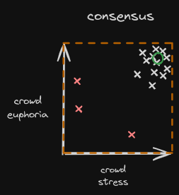

# Stochastic Vector Oracle Consensus

[StarkHack Hackaton](https://ethglobal.com/events/starkhack) participation.

Establish a consensus over oracles' predictions that can evolve through time.

## Mathematical Details of the oracle modelization.

See the mathematical details at [documentation/README.md](documentation/README.md).

## Oracle Smart Contract Interface

See the smart contract interface for oracles at : [oracle_contract/README.md](oreacle_contract/README.md).

## Oracle Client

See the Oracle Client at : [oracle_client/README.md](oracle_client/README.md).

