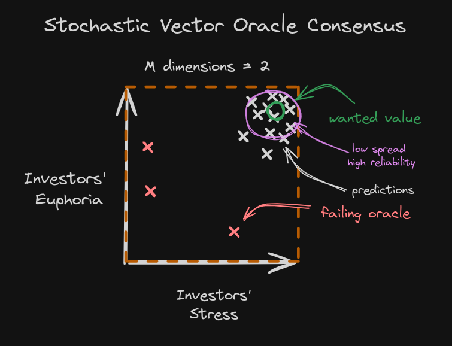
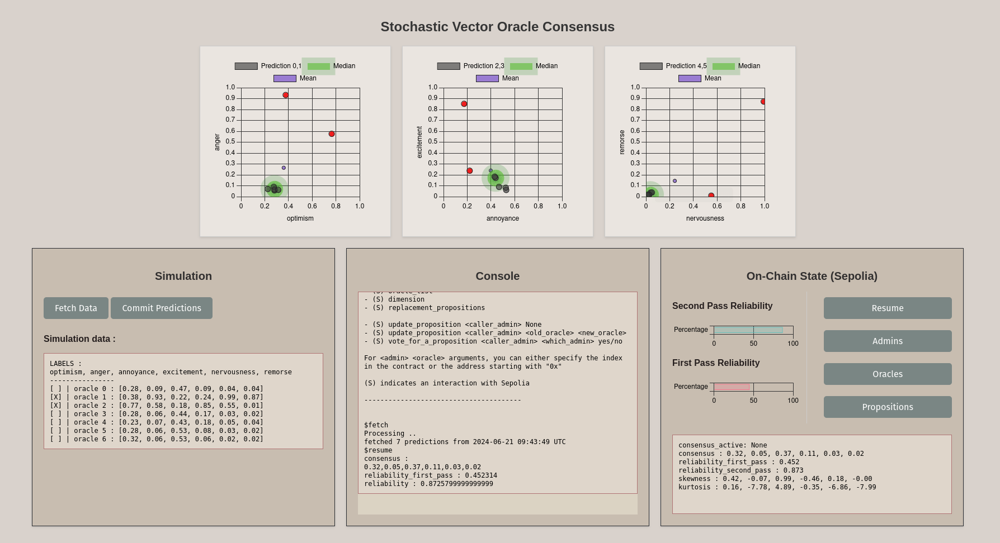

# Stochastic Vector Oracle Consensus

    

Sponsorized by [StarkHack Hackaton](https://ethglobal.com/events/starkhack).

Establish on-chain consensus over predictions from multiple oracles that can evolve over time.
- ✅ Security: The consensus is implemented directly on the Starknet blockchain using smart contracts developed in Cairo.
- ✅ Robustness: The consensus resists failing oracles (e.g., bugs, hacks, statistical errors). Oracles that diverge too much from the group do not influence the consensus.
- ✅ Reliability: The consensus always provides reliability metrics for the algorithms using it.
- ✅ Durability: The consensus resists the test of time. If authorized by the smart contract, admins can vote to replace dead oracles (based on their divergence).

We also provide an oracle client for demonstration purposes.
- Data is scraped in real-time from Hacker News.
- Oracle predictions are based on sentiment analysis over stochastic samples of comments.

## Documentations.

- Mathematical details : [documentation/README.md](documentation/README.md).
- Smart contract interface for oracles : [oracle_contract/README.md](oracle_contract/README.md).
- Oracle Client : [oracle_client/README.md](oracle_client/README.md).
