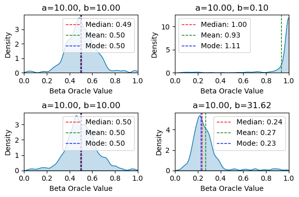

# Mathematical Documentation

## Summary

- [Global Modeling](#global-modeling)
    - [Statistical Model](#statistical-model)
    - [Example](#example)
- [Unimodal Modeling](#unimodal-modeling)
- [Multimodal Modeling (Mixture Model)](#multimodal-modeling-mixture-model)
- [Algorithms](#algorithms)
    - [Consensus](#consensus)
    - [Replacement Vote Implementation](#replacement-vote-implementation)
    - [Benchmarks](#benchmark---identify-the-failing-oracles-uniformely-distributed)
- [Miscellaneous](#miscellaneous)
    - [Payment System / Asynchronous Update](#payment-system-and-better-asynchronous-commits)

## Global Modeling

### Statistical Model

Let $M$ be the number of attributes. \
Let $N$ be the number of oracles.

Let $\Omega = C = ]0, 1[^M \subset \mathbb{R}^M$ be the state space. \
Let's assume $e \in \Omega$ is the true essence of the phenomenon. \
Let $\mu : \Omega \to ]0, 1[$ be the probability law of an oracle.

An oracle's prediction is a realization of the law $\mu$ over $C$.

In this project, we consider $N$ oracles' predictions of the same phenomenon: $(C^N, \mathcal{B}(C)^{\otimes N}, \mu^{\otimes N})$

We want to approximate the value of $e$ and estimate the credibility of this estimation. \
For basic law distributions, the visual intution is to characterize the $e$ value as the mode / center of the spike. 

The kind of models that fit in the modelization constrained over $C$ can be simplified into fuzzy logic : \
A `stress level` valued in $]0;1[$ would make as much sense in `{low, mid-low, moderate, mid-high, high}` \
Therefore, the accuracy of the consensus matters more than the precision of its value.

### Example

Let's say we want to create smart contracts based on the psychology of investors in Bitcoin.
We can base our analysis on the following criteria:
- We model the psychology of an individual as a vector of base:
(stress, anger, euphoria) with values between $0$ and $1$.
- We consider the following two groups: (crowd, famous investors)

An oracle will predict a vector with the following labeled coordinates: \
(crowd stress, crowd anger, crowd euphoria, famous investors stress, famous investors anger, famous investors euphoria)

We consider 3 societies (A, B, C) and 10 oracles with 5 from A, 3 from B, and 2 from C.

It is assumed that oracles from different societies can use different algorithms. \
More precisely, we expect that society do not use the same sources of informations for its oracles. \
If a source of information get hacked, we want to have an on-chain certificate that only a sub part of \
the oracles coming from a society are corrupted.

## Unimodal Modeling

### Constrained over $]0, 1[^M$

A first assumption we can make to simplify the problem is to consider that not matter the society and the algorithm, \
the denormalized prediction $f(X)$ is a gaussian law centered in $e$ :
- $f$ is the denormalized function : $]0, 1[ \to \mathbb{R}$
    - $f : X \to \tan((X - 0.5) \pi)$ $\qquad$
- $f^{-1}$ the normalize function.
    - $f^{-1} : Y \to {arctan(Y) \over \pi} + 0.5$
- $f(X) \sim \mathcal N(e, \sigma Id_M)^N \sim \mathcal N(E, \sigma Id_{MN})$

The samples in ``contract/drafts/gaussian_algorithm_demo.ipynb`` suggests that the use of the normalizing function is hardly workable. \
Hence, the gaussian assumption cannot hold on $]0, 1[$.

Instead, we will now consider the [Bêta](https://fr.wikipedia.org/wiki/Loi_b%C3%AAta) law and [Kumaraswamy](https://fr.wikipedia.org/wiki/Loi_de_Kumaraswamy) law. \
Experiments are done in ``contract/drafts/beta_kumaraswamy_algorithm_demo``.

Those laws seem more to fit the basic intution we have on the distribution of predictions. \
The essence will now be modelized by the mode of the distribution.

Under the Failing Oracale assumption below, the median is a robust estimator :



### Unconstrained, over $R^M$

For regular oracles that predicts values over $R^M$ (eg: price of a barrel of oil, BTC/USD, $\dots$) the gaussian noise modelisation works better.

Essence is then the $\mu$ parameter of the distribution, and reliability a function of $\sigma$.

Thus, the estimator is :

## Multimodal Modeling (Mixture Model)

In a second time we might even consider a case with $K$ instances of $e$ with $\mu_k$ centered in $e$. \
Each oracle will have a probability of $p_k$ to follow $\mu_k$. Mathematicaly :
- $w \sim Mult(1, p)$ ie. $w$ is a discrete random variable of law $p$
- $f(x) \sim \sum^K_k \mathcal{N}(e_k, \sigma_k) \times \mathbb{1}_w$ if $\mu_k$ are gaussians

Example :
- Multiple sources of informations that converge to different pole.
    - Question: how should we interprate this case ?
        - Take the biggest pole ?
        - Average of all poles ?

Currently, we do not provid an algorithm for this specific modelization.

## Failing Oracle

Now, we will consider that when an oracle makes a prediction, it has a probability of $\alpha$ to fail. \
A failing oracle can be modelized as a uniform distribution over $]0, 1[$.
In our estimators, we will consider that there is always exactly $\alpha$ percent of failing oracles.

- Security issues: An oracle can get hacked
- Bug

Consequence : we want to be able to replace only the worst oracle relatively to the consensus.

## Algorithms

### Consensus

In the following, we'll consider a smart contract that establish a consensus on $e$ value and the accuracy of this consensus.

The smooth median $SMED$ of is defined as the average between the two most centered values. \
$m$ := max spread parameter

- Safe check : all the oracles have commited once
- First Pass
    - compute the essence estimator on all the oracles
        - smooth_median | constrained case
        - smooth_median | uconstrained case
    - compute the individual oracles_scores
        - squared distance to the smooth_median | constrained case
        - squared distance to the smooth_median | unconstrained case
    - compute the reliability estimator on all the oracles
        - constrained case : $1 - 2\sqrt{ MEAN ||{X - SMED(X) \over M} }||^2$
        - unconstrained case :
            - let $u := \sqrt{ MEAN ||{X - SMED(X)}||^2}$
            - first pass reliability : $1 - { \min{ms, u } \over ms}$:
- Second Pass
    - compute the essence estimator on the $(1-\alpha)$ percent of the best oracles
        - smooth_median | constrained case
        - mean | uconstrained case
    - compute the reliability estimator on the $(1-\alpha)$ percent of the best oracles
        - constrained case: $1 - 2\sqrt{ MEAN ||{X - SMED(X) \over M} }||^2$ 
        - unconstraned case
            - let $u := \sqrt{ MEAN ||{X - MEAN(X)}||^2}$
            - second pass reliability : $1 - { \min{ms, u } \over ms}$:

Remark: There is no natural order over $\mathbb{R}^M$, therefore, we consider on higher dimension the component wise version of the median/smoth_median.

Idea/Todo: Can we efficiently remplace the smooth median with what i would call the super smooth median? A weighted sum based on the order, where the weights reproduce a bell shape.

### Replacement Vote Implementation

Let $(a_1, \dots, a_A)$ be the admins. \
Let $(o_1, \dots, o_N)$ be the oracles.

Let $(r_1, \dots, r_A)$ be the replacement proposition where the $r_i$ are ``Option<(usize, ContractAddress)>``.

At each time the smart contract keep a boolean valued vote matrix of dimension $A \times A$.

By default :
- Vote matrix is equal to : $(false)_{i,j \in A \times A}$
- Every replacement propositions are nulles.

Admins can vote and discard their vote for an admin proposition.

When :
- Admin $x$ get enough votes
- His replacement proposition is valid
    - ``usize`` oracle index corresponds to a failing oracle
    - ``ContractAddress`` is a valid address
The oracle is replaced.

When an admin change its proposition, he loose all its votes. \
When an oracle is replaced, the vote matrix is reinitialized to its default value$

## Benchmark

Basic, benchmark on constrainted estimator (with the median instead of the smoothed median). \
Be very careful with the results, a low success rate doesn't mean the estimator doesn't work. \
The failing oracles follow an uniform distribution, thus it's possible that they give an accurate value.

Example : 


### Python tests of the first pass constrained estimator :

source code in ``contract/drafts/beta_kumaraswamy_algorithm_demo``

```python
def rank_array(list : List[float], normalized=True) -> List[float] :
    '''
        Takes a list of values.
        Replace them with a deviation score (the highest the best).
    '''
    s = np.argsort(list)
    rev_indexes = [0 for i in range(len(s))]
    for from_idx, to_idx in enumerate(s):
        rev_indexes[to_idx] = s.size - from_idx - 1

    return np.array(rev_indexes) / (s.size - 1), np.array(rev_indexes)

def identify_failing_oracles(oracles_predictions : List[np.array], N_failing_oracles):
    median = np.median(oracles_predictions, axis=0)
    deviation_from_median = [np.linalg.norm(pred - median) for pred in oracles_predictions]
    normalized_ranks, ranks = rank_array(deviation_from_median)
    result = [ rank >= N_failing_oracles for rank in ranks ]
    return result

def restricted_median(predictions : List[np.array], activated : List[bool]):
    predictions_activated = compress(predictions, activated) # from itertools
    return np.median(list(predictions_activated), axis=0)

def verify(left, right) :
    for x, y in zip(left, right):
        if x != y : return False
    return True
```

```python
def benchmark(a : float, b : float, N_oracles, N_failing_oracles, K : int = 100):
    success = 0
    distance = 0
    for _ in range(K) :
        oracles, true_oracles = generate_beta_oracles(N_oracles, N_failing_oracles, a, a)
        identified = identify_failing_oracles(oracles, N_failing_oracles)
        if verify(identified, true_oracles) :
            success += 1

        predicted_median = restricted_median(oracles, identified)
        truth_median = restricted_median(oracles, true_oracles)
        distance += np.linalg.norm(predicted_median - truth_median)

    success_rate = 100 * (success / K)
    reliability = 100 * (1 - 2*(distance / K))

    s = "{:<40}".format(f"a={a} | b=({b[0]:0.5f}, {b[1]:0.4f})")
    print(f"{s}| identification success: {success_rate:0.2f} % | reliability : {reliability:0.02f} % ")

def launch_benchmark(N_oracles, N_failing_oracles):
    for a in [10, 20, 30, 100] :
        print("---")
        for b in [(15, 30), (a, a), [a, a**3], (a**3, -a**3), (a**4, a**-4)] :
            benchmark(a, b, N_oracles, N_failing_oracles, 300)
```

### Oracles/Fails = 7/2 
```python
launch_benchmark(N_oracles=7, N_failing_oracles=2)
```
```
a=10 | b=(15.00000, 30.0000)            | identification success: 37.33 % | true consensus reliability : 95.62 % 
a=10 | b=(10.00000, 10.0000)            | identification success: 40.33 % | true consensus reliability : 95.92 % 
a=10 | b=(10.00000, 1000.0000)          | identification success: 33.00 % | true consensus reliability : 94.00 % 
a=10 | b=(1000.00000, -1000.0000)       | identification success: 36.33 % | true consensus reliability : 95.33 % 
a=10 | b=(10000.00000, 0.0001)          | identification success: 38.67 % | true consensus reliability : 95.41 % 
---
a=20 | b=(15.00000, 30.0000)            | identification success: 52.67 % | true consensus reliability : 97.36 % 
a=20 | b=(20.00000, 20.0000)            | identification success: 51.33 % | true consensus reliability : 97.64 % 
a=20 | b=(20.00000, 8000.0000)          | identification success: 43.00 % | true consensus reliability : 97.52 % 
a=20 | b=(8000.00000, -8000.0000)       | identification success: 48.67 % | true consensus reliability : 97.15 % 
a=20 | b=(160000.00000, 0.0000)         | identification success: 58.33 % | true consensus reliability : 97.94 % 
---
a=30 | b=(15.00000, 30.0000)            | identification success: 63.33 % | true consensus reliability : 98.35 % 
a=30 | b=(30.00000, 30.0000)            | identification success: 63.00 % | true consensus reliability : 98.35 % 
a=30 | b=(30.00000, 27000.0000)         | identification success: 58.33 % | true consensus reliability : 97.75 % 
a=30 | b=(27000.00000, -27000.0000)     | identification success: 59.00 % | true consensus reliability : 98.53 % 
a=30 | b=(810000.00000, 0.0000)         | identification success: 59.33 % | true consensus reliability : 97.85 % 
---
a=100 | b=(15.00000, 30.0000)           | identification success: 73.33 % | true consensus reliability : 99.29 % 
a=100 | b=(100.00000, 100.0000)         | identification success: 72.67 % | true consensus reliability : 99.44 % 
a=100 | b=(100.00000, 1000000.0000)     | identification success: 76.33 % | true consensus reliability : 99.48 % 
a=100 | b=(1000000.00000, -1000000.0000)| identification success: 71.67 % | true consensus reliability : 99.53 % 
a=100 | b=(100000000.00000, 0.0000)     | identification success: 76.33 % | true consensus reliability : 99.40 % 
```

### Oracles/Fails = 20/2

```
launch_benchmark(N_oracles=20, N_failing_oracles=1)
```

```
a=10 | b=(15.00000, 30.0000)            | identification success: 27.00 % | true consensus reliability : 98.59 % 
a=10 | b=(10.00000, 10.0000)            | identification success: 26.00 % | true consensus reliability : 98.71 % 
a=10 | b=(10.00000, 1000.0000)          | identification success: 25.33 % | true consensus reliability : 98.58 % 
a=10 | b=(1000.00000, -1000.0000)       | identification success: 27.33 % | true consensus reliability : 98.65 % 
a=10 | b=(10000.00000, 0.0001)          | identification success: 33.33 % | true consensus reliability : 98.76 % 
---
a=20 | b=(15.00000, 30.0000)            | identification success: 46.33 % | true consensus reliability : 99.30 % 
a=20 | b=(20.00000, 20.0000)            | identification success: 44.00 % | true consensus reliability : 99.32 % 
a=20 | b=(20.00000, 8000.0000)          | identification success: 45.33 % | true consensus reliability : 99.35 % 
a=20 | b=(8000.00000, -8000.0000)       | identification success: 44.67 % | true consensus reliability : 99.28 % 
a=20 | b=(160000.00000, 0.0000)         | identification success: 42.00 % | true consensus reliability : 99.27 % 
---
a=30 | b=(15.00000, 30.0000)            | identification success: 49.67 % | true consensus reliability : 99.52 % 
a=30 | b=(30.00000, 30.0000)            | identification success: 52.67 % | true consensus reliability : 99.55 % 
a=30 | b=(30.00000, 27000.0000)         | identification success: 49.00 % | true consensus reliability : 99.56 % 
a=30 | b=(27000.00000, -27000.0000)     | identification success: 54.67 % | true consensus reliability : 99.52 % 
a=30 | b=(810000.00000, 0.0000)         | identification success: 57.33 % | true consensus reliability : 99.64 % 
---
a=100 | b=(15.00000, 30.0000)           | identification success: 72.00 % | true consensus reliability : 99.85 % 
a=100 | b=(100.00000, 100.0000)         | identification success: 70.67 % | true consensus reliability : 99.82 % 
a=100 | b=(100.00000, 1000000.0000)     | identification success: 78.33 % | true consensus reliability : 99.86 % 
a=100 | b=(1000000.00000, -1000000.0000)| identification success: 69.33 % | true consensus reliability : 99.81 % 
a=100 | b=(100000000.00000, 0.0000)     | identification success: 69.67 % | true consensus reliability : 99.86 % 
```

### Oracles/Fails = 20/15

Even, over with 3/4 of failing oracles, the consensus remains reliable to the truth value.

```
launch_benchmark(N_oracles=20, N_failing_oracles=15)
```
```
a=10 | b=(15.00000, 30.0000)            | identification success: 0.33 % | true consensus reliability : 89.04 % 
a=10 | b=(10.00000, 10.0000)            | identification success: 2.00 % | true consensus reliability : 90.20 % 
a=10 | b=(10.00000, 1000.0000)          | identification success: 0.67 % | true consensus reliability : 89.37 % 
a=10 | b=(1000.00000, -1000.0000)       | identification success: 0.67 % | true consensus reliability : 90.60 % 
a=10 | b=(10000.00000, 0.0001)          | identification success: 1.00 % | true consensus reliability : 89.34 % 
---
a=20 | b=(15.00000, 30.0000)            | identification success: 1.67 % | true consensus reliability : 90.76 % 
a=20 | b=(20.00000, 20.0000)            | identification success: 2.67 % | true consensus reliability : 92.45 % 
a=20 | b=(20.00000, 8000.0000)          | identification success: 1.33 % | true consensus reliability : 92.74 % 
a=20 | b=(8000.00000, -8000.0000)       | identification success: 1.67 % | true consensus reliability : 90.85 % 
a=20 | b=(160000.00000, 0.0000)         | identification success: 2.00 % | true consensus reliability : 92.33 % 
---
a=30 | b=(15.00000, 30.0000)            | identification success: 4.33 % | true consensus reliability : 93.07 % 
a=30 | b=(30.00000, 30.0000)            | identification success: 1.67 % | true consensus reliability : 92.89 % 
a=30 | b=(30.00000, 27000.0000)         | identification success: 4.00 % | true consensus reliability : 93.76 % 
a=30 | b=(27000.00000, -27000.0000)     | identification success: 4.00 % | true consensus reliability : 93.30 % 
a=30 | b=(810000.00000, 0.0000)         | identification success: 3.67 % | true consensus reliability : 93.26 % 
---
a=100 | b=(15.00000, 30.0000)           | identification success: 12.00 % | true consensus reliability : 95.16 % 
a=100 | b=(100.00000, 100.0000)         | identification success: 12.00 % | true consensus reliability : 95.54 % 
a=100 | b=(100.00000, 1000000.0000)     | identification success: 10.67 % | true consensus reliability : 95.53 % 
a=100 | b=(1000000.00000, -1000000.0000)| identification success: 11.67 % | true consensus reliability : 96.53 % 
a=100 | b=(100000000.00000, 0.0000)     | identification success: 13.67 % | true consensus reliability : 96.06 % 
```

## Miscellaneous

### Payment System and better asynchronous commits
---

Remarks : 

- 🚧 Requires an encryption of the storage
- The update of the consensus works in two passes.
- Oracle commit asynchronously.
- There are two list of oracles (Rapid, Slow).
- An oracle can only commit twice during an epoch.
    - Only the second commit will be deloyed to next epoch.
- Users pay fees to the bank of the smart contract

**First Pass** : \
When a majority of oracles have commited, they are moved in the "Rapid" bucket \
The consensus has now enough informations to be updated. \
Each next commits during the second pass will enrich it.

**Second Pass** : \
Slow oracles that commits during the second pass are sent to the "Slow" bucket.

**Rewards** : \
For instance we can define the score as : \
$s_i :=$ $\alpha (1 - {||c_i - e||^2 \over \max_i || c_i - e ||^2}) + (\mathbb{1}_\text{rapid} - \alpha)$

Then $\beta$ percent of the bank will be distributed to the oracles accordingly to their scores.

**Next Epoch** : \
When enough oracles have commited for a second time during the epoch, they are sent to the rapid bucket of the next epoch.
